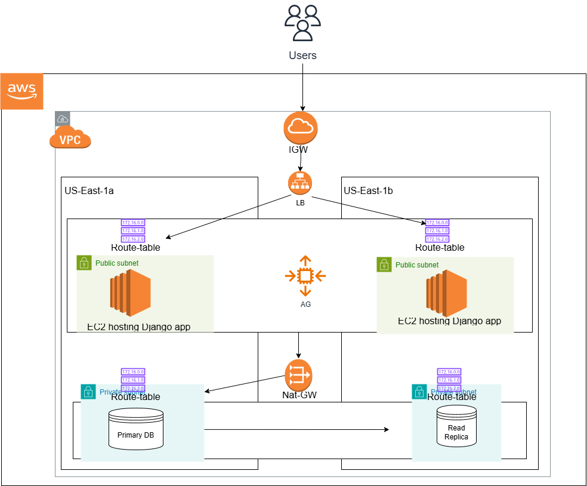

**Infrastructure Overview**

The following document outlines the infrastructure setup for deploying the Django application on AWS. The architecture is designed to ensure **high availability, security, scalability, and minimal downtime** for users.

**Architecture Overview**

The infrastructure follows the requirement that the application should be **highly available** with minimal downtime. To achieve this, the following components were implemented:

**1\. Virtual Private Cloud (VPC)**

- A **VPC** was created to provide **network isolation** and enhanced security.
- The VPC includes **two Availability Zones (AZs)** for redundancy.
- Two subnets were provisioned:
  - **Public Subnet**: Hosts the **Ubuntu 24.04 web servers** running the Django application.
  - **Private Subnet**: Hosts the **PostgreSQL database**.

**2\. Database (PostgreSQL)**

- A **single PostgreSQL database** is provisioned in the private subnet.
- A **replica** is created in another AZ to enhance data availability.
- All instances connect to the **same primary database**.

**3\. Load Balancer (AWS ALB)**

- An **Application Load Balancer (ALB)** distributes traffic across multiple instances.
- The ALB ensures **continued uptime** by redirecting traffic in case an AZ or an instance becomes unhealthy.

**4\. Auto Scaling**

- **Horizontal Auto Scaling** is enabled:
  - **New instances are added** when CPU utilization exceeds **70%**.
  - **Instances are removed** when CPU utilization drops below **30%**.
- **Vertical Scaling** is also possible by modifying:
  - **Instance type**
  - **Root volume size** in variables.tfvars
- If a user prefers **manual scaling**, the autoscaling.tf file can be disabled.

**5\. Modular Configuration**

- The **design is modular**, allowing users to modify configurations easily via variables.tfvars.
- **Key variables to customize**:
  - **Region**
  - **AZs**
  - **ssh_file**
  - **AMI (Amazon Machine Image)**
- Other values can remain at their default settings.

**Deployment Instructions (Terraform)**

To deploy the infrastructure, follow these steps:

**1\. Navigate to the Terraform Directory**

cd Terraform

**2\. Initialize Terraform**

terraform init

**3\. Preview the Execution Plan**

terraform plan

**4\. Apply the Terraform Configuration**

terraform apply --auto-approve

**Requirements**

- Terraform must be **installed** on your CLI.
- AWS CLI must be **installed and configured** with your credentials.

**Expected Outputs**

After a successful deployment, Terraform will output three values:

1. **alb_dns_name** – The **Application Load Balancer (ALB) DNS** used to access the application in the browser (e.g., http://alb_dns_name/quotes).
2. **public_ip** – The **public IP addresses** of the provisioned instances.
3. **db_endpoint** – The **PostgreSQL database endpoint** for connecting to the database.

**⏳ Provisioning Time:** The setup process may take approximately **7 – 15 minutes**.

**CI/CD Pipeline Overview**

**Technology Used: GitHub Actions**

A **GitHub Actions** workflow is used to **automate deployment** of the Django application.

**Required GitHub Secrets**

Before running the pipeline, **create the following secret credentials** in GitHub:

| **Secret Name** | **Description** |
| --- | --- |
| DOCKER_HUB_USERNAME | Your DockerHub username |
| DOCKER_HUB_PASSWORD | Your DockerHub password |
| SSH_PRIVATE_KEY | The private key used to create into EC2 instances on terraform |
| SSH_HOST | The public IPs of the provisioned instances (e.g., 1.2.3.4,5.6.7.8) |
| DOT_ENV | The .env file contents (ensure DB_HOST=db_endpoint) |

**Pipeline Execution**

- **Trigger**: The pipeline is manually triggered from the **GitHub Actions** tab.
- **Process**:
    1. **Build a Docker image** using the provided Dockerfile.
    2. **Tag the Docker image** with the GitHub Actions run number.
    3. **Push the image to DockerHub** using the stored credentials.
    4. **SSH into the Ubuntu VM**, pull the latest image, and restart the container.

**Versioning & Rollbacks**

- Each Docker image is **versioned** (tagged per commit).
- If a deployment fails, a **rollback** can be performed using a **previous version**.

**Application Access**

After deployment, the application can be accessed via:

http://alb_dns_name/quotes

**Files & Folders created**

| **File/Folder** | **Description** |
| --- | --- |
| Dockerfile | Defines the containerized Django app |
| Terraform/ | Terraform configuration files |
| .github/ | GitHub Actions workflow files |
| tfplan.txt | Terraform plan output |
| requirements.txt | Contains project dependencies |

**Note:** python-dotenv was added to requirements.txt to allow **Python to read environment variables** from .env.

**Conclusion**

This infrastructure is designed for **high availability**, **scalability**, and **automated deployments** while ensuring **minimal downtime**.

For further improvements, the pipeline could be extended to support **automated rollback** in case of a failed deployment.